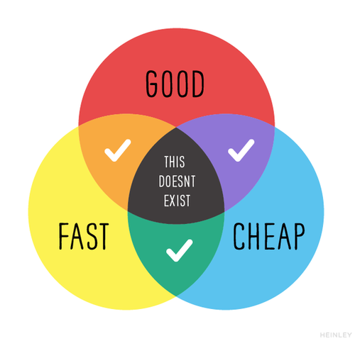

# Functions semanticJS and abstractions

- Define Abstraction
- Identify the inputs of a function
- Identify the outputs of a function
- Identify the side effects of a function
- Define Functional Programming
- Write semantic javascript variable names
- Define coupling with respect to software development
- Define cohesion with respect to software development
- Identify the subjectivity of engineering

## Admin (3/3)

### Admin - zoom "guidelines"
Some guidelines might be helpful.

First and foremost, audience participation is welcome and encouraged.

That said, it being a zoom call, look for pauses and defer to other speakers that begin earlier.

Alternatively, another way to get heard or ensure a question is answered is to propose the question in the slack channel #js-functions-abstractions

### Admin - installation
Install this repository if you'd like to run any of these scenarios locally.

The backend service used in this lesson is an express server, to install and run:

```bash
$ git clone git@github.com:andrewsunglaekim/js-functions-semantics-and-abstractions.git
$ cd js-functions-semantics-and-abstractions
$ npm install nodemon -g
$ npm install
$ nodemon server.js
```

> Nodemon runs node services that restart the service if it detects changes in the directory. We should be able to see json of some messages in our browser now at `http://localhost:4000/messages/`


## Framing - Abstraction (5/8)
As developers we're told from the beginning to keep things DRY. It's something that constantly nags at us almost to a detriment.

When we start weighing our decisions against one another, that's when real engineering starts. Abstraction is at the crux of all of that.

Wikipedia:

> the concept of procedures, functions, or subroutines which represent a specific of implementing control flow in programs;

In this lesson, we'll introspect on this repository at various branches.

### A contrived thought experiment
Imagine a world where logging hello is a feature. A company says I need this feature:

```js
console.log('hello');
```

The company then says wow, what a great feature. We want it to happen twice we liked it so much. Got you fam:

```js
console.log('hello');
console.log('hello');
```

The company then says, "This isn't a feature for ants. I'm going to have to see that feature at least 3 times."

We stop. We've seen this before. We think ahead. Boom:

```js
const numberOfTimesToPrintHello = 3
for (let i = 0; i < numberOfTimesToPrintHello; i++) {
  console.log('hello');
}
```

"We do it this way because we can just change the number to whatever we need in the future!"

**So often, we solution faster than we domain.**

Maybe we should have started with some questions first.

- Are we going to have to do this again?
- How often and what will trigger it?
- What more information do we need about this feature's scope?

Maybe, just MAYBE. 3 times was exactly the number of times they wanted for this feature to happen on load. And that's all that will ever be required.

Perhaps the right answer for this scenario was

```
console.log('hello');
console.log('hello');
console.log('hello');
```

Another question we should have asked, especially in this contrived case, was:

- Why are we doing this at all?

This thought experiment is a metaphor for engineering. We're constantly weighing things as we solution. Today we'll look at several snippets of code. Let's look at the code with as many angles as possible.

## We do - 3 minute Code Review (3/11)

Checkout to the `first-exercise` branch.

```
$ git checkout first-exercise
$ open index.html
// alternatively, open the index.html in the browser in a different way
```

Spend the next 3 minutes familiarizing with the dataset, reviewing the html and javascript, viewing the page in the browser.

## We do - Code smells/Code improvements - (6/17)

Code smell always has a negative connotation. We're not looking for bad code. What we're looking for are **potential** ways to improve upon our code.

In groups, identify some ways we might improve `client.js`:

```js
function init() {
  fetch('http://localhost:4000/messages/')
    .then((res) => {
      return res.json();
    })
    .then((res) => {
      // destructures messages from response
      const { messages } = res;
      messages.forEach((message) => {
        // creates element to append
        const el = document.createElement('div');

        // intializes time variables
        const date = luxon.DateTime.fromISO(message.timestamp);
        const amPM = date.hour > 12 ? 'pm' :'am';
        const hour = date.hour > 12 ? date.hour % 12 : date.hour;

        // adds dom content
        el.className = `message ${message.focused ? 'message--reversed' : ''}`
        el.innerHTML = `
          <div class="message__row">
            <div class="message__content">
              <div class="message__time">
                ${`${date.day} ${date.monthShort} ${hour}:${date.minute} ${amPM}`}
              </div>
              <div class="message__body">
                ${message.body}
              </div>
            </div>
            <div class='message__user'>
              <div class='message__username'>
                ${message.username}
              </div>
              
            </div>
          </div>
        `

        // appends to list
        const messagesEl = document.querySelector('.messages')
        messagesEl.appendChild(el)
      });
    });
}

init();
```

There's ultimately nothing too incorrect about this code. It's a bit procedural, but it gets the job done well enough in just under 50 lines of code.. with comments!

The biggest issue is there is almost no abstraction aside from using the luxon library and internal JS methods. If we know this "feature" will be exactly just rendering 4 messages, this code may be just fine.

However, that's usually not the case in development. Scope creep and changing requirements are norms of the industry.

We want to write code with abstractions to help us reuse functionality.

Let's take a look at a different solution with some abstractions added to it.

## We do - 3 minute Code Review (3/20)

Look at the implementation of rendering these messages.

Checkout to the `second-exercise` branch.

```
$ git checkout second-exercise
$ open index.html
// alternatively, open the index.html in the browser in a different way
```

You should now see a "chat transcript" in the browser.

> this code snippet and all future ones assumes you have the local server running from the admin section

The files that are creating this view is located in `index.html`:

- `utils/buildMessage.js`
- `utils/buildMessages.js`
- `utils/parseTime.js`
- `client.js`

## We do - think-pair-share Groups (30/50)

As groups, we'll review 4 primary functions in this code base: `buildMessage`, `buildMessages`, `parseTime`, and `fetchData`.

Spend the next 5 minutes talking about the function our group was assigned. While discussing the merits and detriments of your function think about and use the following 3 words:

- input(s)
- output(s)
- side effect(s)

### Remote Alternative
Identify on your own the following things about each function for 6 minutes:

- inputs
- output
- side effects
- potential improvements

We will then discuss as class remotely!


### Inputs, Output, Side Effects

By definition, these things are very simple and intuitive:

```js
function add(num1, num2) {
  console.log(num1);
  return num1 + num2
}
```

For function `add`:

- inputs: `num1`, `num2`

- output: `num1 + num2`

- side effects: `num1` is logged.

How we use inputs, outputs, and side effects; moreover, how we organize them together are not so simple and intuitive.

### `buildMessages`

```js
function buildMessages(data){
  const { messages } = data;
  messages.forEach((message) => {
    buildMessage(message);
  });
}
```

What are the inputs of the `buildMessages`?

- `data`

What is the output of `buildMessages`?

- `undefined`

What are the side effects?

- a loop of `buildMessage` runs passing each message to the callback.

> It should be noted that client software is a world of side effects.

What about `forEach`? What are it's inputs, outputs and side effects?

### `buildMessage`

```js
function buildMessage(message) {
  const el = document.createElement('div');
  el.className = `message ${message.focused ? 'message--reversed' : ''}`
  el.innerHTML = `
    <div class="message__row">
      <div class="message__content">
        <div class="message__time">
          ${parseTime(message.timestamp)}
        </div>
        <div class="message__body">
          ${message.body}
        </div>
      </div>
      <div class='message__user'>
        <div class='message__username'>
          ${message.username}
        </div>
        
      </div>
    </div>
  `
  const messagesEl = document.querySelector('.messages')
  messagesEl.appendChild(el)
}
```

- Inputs: `message` argument

- Output: none, technically it's `undefined`

- Side effects: everything in this function is a side effect

This function probably does a bit too much. To be fair a lot of this function's body is just a bunch of template.

It still has a reliance against the DOM (eg. `document.querySelector('.messages')`) in order to render the message. It feels like there's a better a pattern that can be used here.


### `parseTime`

```js
function parseTime(dateTimeString) {
  const date = luxon.DateTime.fromISO(dateTimeString);
  const amPM = date.hour > 12 ? 'pm' :'am';
  const hour = date.hour > 12 ? date.hour % 12 : date.hour;
  return `${date.day} ${date.monthShort} ${hour}:${date.minute} ${amPM}`
}
```

- Inputs: `dateTimeString`

- Output: a human readable time string

- Side effects: variable assignment, conditional operators?

This function alternatively has less(no?) side effects when compared to `buildMessage`.

#### Functional programming

Wikipedia:

>  treats computation as the evaluation of mathematical functions and avoids changing-state and mutable data.

> In functional code, the output value of a function depends only on its arguments, so calling a function with the same value for an argument always produces the same result.

Of all functions we've gone over, `parseTime` is the most functional. That's not to say the other functions aren't correct or valid. There's a wide spectrum of choices we have when writing code. Functional programming is one of several patterns we should be reaching for.

### `fetchData`

```js
function fetchData() {
  fetch('http://localhost:4000/messages/')
    .then((res) => {
      return res.json();
    })
    .then((res) => {
      // destructures messages from response
      buildMessages(res);
    });
}

fetchData();
```

- Inputs: no inputs

- Output: no output

- Side Effects: yes...

This function does fetch data, but it also builds messages?

#### SemanticJS

This isn't a piece of software, its a header for this part of the lesson. The idea is we want to have GREAT variable names. We all intrinsically know this as developers. Despite this, we struggle with naming things all the time. We could easily make the argument that the functions are semantically named.

Let's spend some time looking at the semantics of our functions above. `parseTime` and `buildMessages` for the most part check out in terms of semantics. We could probably make arguments against even those.

`buildMessage` and `fetchData` are bigger offenders when it comes to javascript semantics. Ironically `buildMessage` is named poorly because of it's other short coming of being on something reliant of the dom:

```js
const messagesEl = document.querySelector('.messages')
messagesEl.appendChild(el)
```

It not only builds a message but it also appends it to the first element that matches the `.messages` selector...yikes

`buildMessage` is probably still better here than `buildMessageThenAppendToMessagesEl`

`fetchData` really should be called `fetchDataAndRenderApp`. Because that's what it does. Additionally it lives in the `client.js` file. That feels weird.

Ironically, our `first-exercise`'s `init` function is more semantic and appropriate then the choice here.

These are small and minor things but if we think about them innately while we develop, it goes a long way. In the case of the `buildMessage` function, focusing on the semantics helped unveil other underlying issues with the function itself.

### Coupling and Cohesion

When we break apart the **semantics** of the name `fetchData` and it's fallacies we're really touching on extremely important "measurements" in programming.

These "measurements" are somewhat subjective but it gives us a mold to formulate our code against. Because wikipedia just does it right:

Coupling:

> coupling is the degree of interdependence between software modules; a measure of how closely connected two routines or modules are

Cohesion:

> cohesion refers to the degree to which the elements inside a module belong together

These definitions pertain to software modules, but we as developers can translate these patterns to something as simple as the current codebase for this workshop.

The goal as developers is to have low coupling and high cohesion. `fetchData` couples fetching with building messages. `parseTime`, alternatively, has high cohesion because it's only doing time parsing stuff and doesn't have any unnecessary side effects.

## We do - One more look - 3 minute Code Review (3/20)

Look at the implementation of rendering these messages.

Checkout to the `third-exercise` branch. Review this code for 3 minutes.

```
$ git checkout third-exercise
$ open index.html
// alternatively, open the index.html in the browser in a different way
```

If we look at the new `client.js`:

```js
function init() {
  fetchMessages().then((messages) => {
    const messagesEl = document.querySelector('.messages')
    const messagesView = new MessagesView(messages, messagesEl);
    messagesView.renderMessages();
  });
}

init();
```

This functions feels more semantic in terms of fetching data then rendering the application.

We'll note here that the message fetching has been abstracted into `fetchMessages` defined in:

```js
function fetchMessages() {
  return fetch('http://localhost:4000/messages/')
    .then((res) => {
      return res.json();
    })
    .then((res) => {
      const { messages } = res
      return messages;
    })
}
```

In a future lesson in this series, we'll go over how asynchronous code works in greater detail. But for the purposes of this lesson, `fetchMessages` has a clearer more singular purpose.

The change from `fetchData` to `fetchMessages` is small, but can be subjectively significant. As the application grows we might need to fetch other data in which case we would be glad our method was already named `fetchMessages`. Alternatively, if the data never changes perhaps `fetchData` is correct after all.

### The Views

### `MessageView`

Honestly there's not too much that's different. It's mostly just a class wrapper around the `buildMessage` function. There are a couple of significant distinctions.

```js
class MessageView {
  constructor(msg) {
    this.msg = msg;
  }

  render() {
    const el = document.createElement('div');
    el.className = `message ${this.msg.focused ? 'message--reversed' : ''}`
    el.innerHTML = `
      <div class="message__row">
        <div class="message__content">
          <div class="message__time">
            ${parseTime(this.msg.timestamp)}
          </div>
          <div class="message__body">
            ${this.msg.body}
          </div>
        </div>
        <div class='message__user'>
          <div class='message__username'>
            ${this.msg.username}
          </div>
          
        </div>
      </div>
    `
    return el;
  }
}
```

In this code, the `render` methods returns a DOM element as an output. In `buildMessage` the DOM element gets appended as a side effect.

### `MessagesView`

The other difference between the the old implementation and this one is that the appending happens at the messages  layer instead of the individual message layer.


```js
class MessagesView {
  constructor(messages, el) {
    this.messages = messages;
    this.el = el;
  }

  renderMessages() {
    this.messages.forEach((message) => {
      const messageView = new MessageView(message)
      this.el.appendChild(messageView.render());
    })
  }
}
```

## The spectrum of engineering and some closing thoughts

There isn't a world where any of these answers are always correct. We could probably be convinced that our first example was the best solution **if** this contrived application is all it will ever be. 

The last solution feels kind of better then the first and second? The reality is that there are a ton of great solutions to this problem. The solution we end up picking depends on significantly more factors than were covered in this lesson.

Being a developer is a challenging and rewarding field. Every time we write functions in javascript, we need to be able to just intrinsically know all the stuff we just covered. They're basic things sometimes but for whatever reason we give it cursory thought.




This a funny diagram that really speaks to the line of work we do. We weigh tons of factors writing code. 


### Closing

As a development culture, we always want to learn and use the latest and greatest technology.

Syntax, languages, frameworks, librariers. They come and go. Patterns, however, stick around. Strong mastery over fundamentals help us recognize these fundamentals more innately as we develop. 


Keep simple things we've discussed in this lesson at the fore front of our minds when building out functions until they become second nature:
 
 - javascript semantics
 - single responsibility 
 - functional 
 - coupling 
 - cohesion

Keep those things in mind as we organize things like:

- variable names
- inputs
- outputs
- side effects
